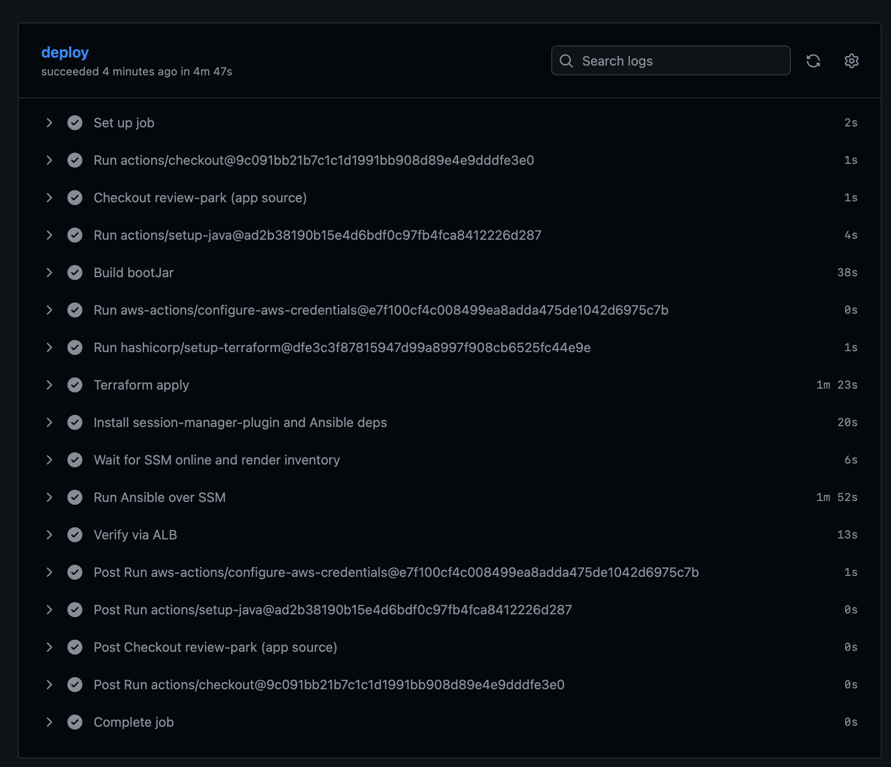
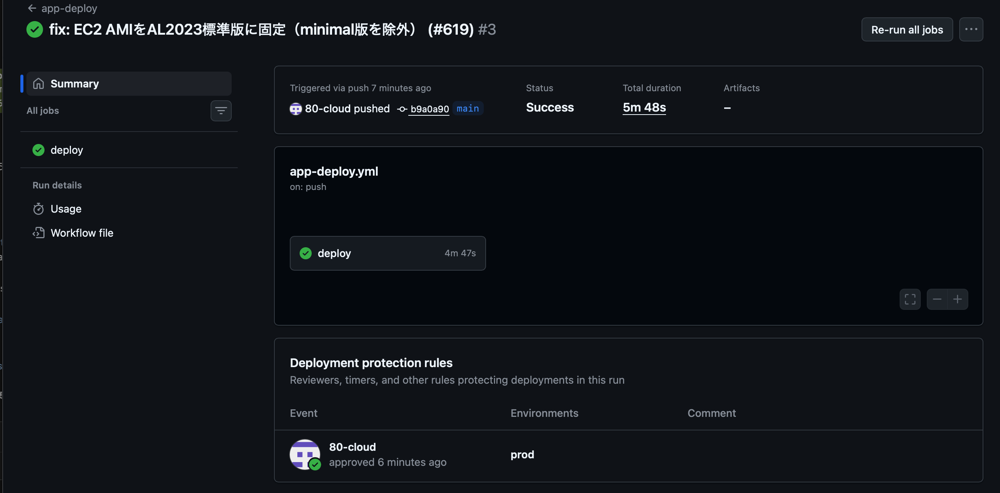
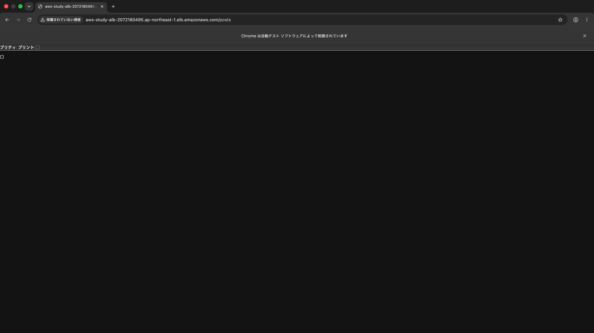
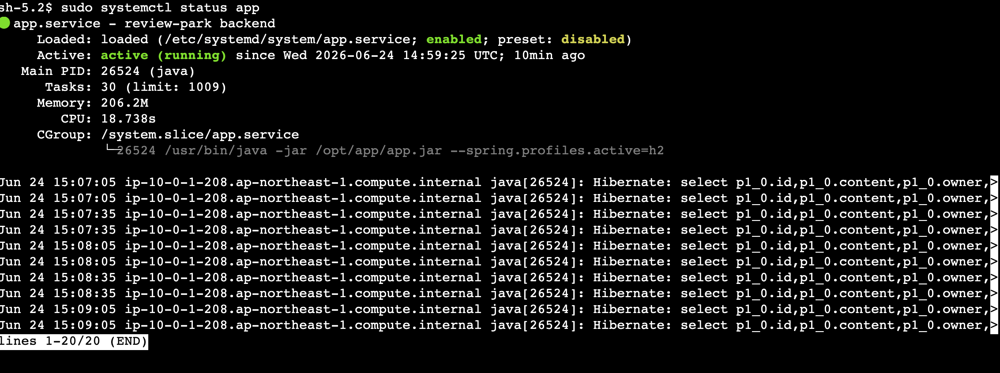
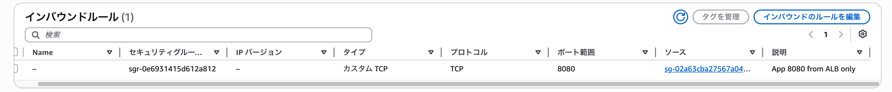
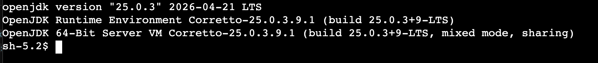

# 集大成課題：GitHub Actions による完全自動デプロイ（SSM / systemd）

`main` への push をトリガに、**Terraform で環境構築 → Ansible（SSM 接続）で Spring Boot アプリを systemd 自動起動 → ALB 経由で疎通確認** までを 1 本のワークフローで自動化しました。SSH（22番）は一切開けず、接続・運用は SSM Session Manager で行います。部分変更の実演として Java 21→25 への更新も実施しています。

- 提出リポジトリ
  - インフラ/CD（public）: https://github.com/80-cloud/study-boards `aws-study/`
  - アプリ（private・Spring Boot）: https://github.com/80-cloud/review-park `backend/`

---

## 1. アーキテクチャ

```
GitHub push (main)
   └─ app-deploy.yml（environment: prod 承認ゲート / OIDC）
        1. review-park(private) を PAT で checkout
        2. runner で bootJar(app.jar) をビルド（EC2ではビルドしない＝OOM回避）
        3. OIDC で apply ロールを assume（長期キー不使用）
        4. terraform apply（VPC + ALB(2AZ) + EC2 のみ／serverless・RDSは既定off）
        5. SSM が Online になるまで待機
        6. ansible-playbook（amazon.aws.aws_ssm 接続）で配置・systemd 起動
        7. ALB DNS の /posts が 200 を返すか検証

  Internet → ALB(public 2AZ) --8080(ALB SGのみ)--> EC2(public/t3.micro)
                                                     - SSH 22 なし（SSM接続）
                                                     - systemd で app.jar 起動(H2)
  EC2 → Secrets Manager（JWT を取得し /etc/app/app.env 0600 へ）
```

---

## 2. 採点基準との対応

| 採点項目 | 対応 | 証跡 |
|---|---|---|
| 🔴 SSH 22 を 0.0.0.0/0 に開けない | EC2-SG から 22 ingress を撤去（8080 は ALB SG のみ） | 📷05 ／ `modules/security/main.tf` ／ `tests/security.tftest.hcl` run③ |
| ALB は internet-facing | `internal = false` | `modules/alb/main.tf` |
| ALB SG で 22 を許可しない | ALB-SG は 80 のみ | `tests/security.tftest.hcl` run② |
| TG ポート = アプリポート(8080) | TG=8080 | `tests/security.tftest.hcl` run① |
| SSM 接続採用→22 完全閉鎖 | Session Manager で接続/確認 | 📷04 📷06 |
| systemd ユニット化（enabled/started） | `roles/deploy_app`（template+systemd・Restart=always） | 📷04 |
| 冪等性 | dnf/user/copy/template/systemd の冪等モジュール・version は `java_version` 変数 | `roles/deploy_app/tasks/main.yml` |
| SSM 必須3点① プロファイルに `AmazonSSMManagedInstanceCore` | アタッチ済・Outputs/テストで担保 | `modules/iam/main.tf`／`outputs.tf`／`tests` run④⑤ |
| SSM 必須3点② AMI に SSM Agent | AL2023 標準版に固定（minimal は除外） | `modules/compute/main.tf` |
| SSM 必須3点③ EC2→SSM 到達 | public サブネット＋egress（NAT不要） | `modules/network`／`modules/security` |
| IAM 最小権限 | Secrets は対象 ARN 限定 read・ECR readonly は削除 | `modules/iam/main.tf` |
| 機密の受け渡し | Secrets Manager → `/etc/app/app.env`(0600)→ EnvironmentFile（`no_log`） | `roles/deploy_app`／`modules/secrets/main.tf` |
| ワークフロー最終系 1 本 | `app-deploy.yml` に統合・旧 SSH 資産（terraform-cd/ansible-java/ansible-infra/install-java）撤去 | `.github/workflows/app-deploy.yml` |
| カスタムアクション最新 | checkout v7.0.0／setup-terraform v4.0.1／configure-aws v6.2.0／setup-java v5.3.0（SHA固定） | `app-deploy.yml` |
| README に SSM・OIDC 再現手順 | 1 節にまとめ | `aws-study/ansible/README.md` |
| 部分変更の実演 | Java 21→25（2リポ5点を整合） | 📷06 ／ PR #70・#621 |

---

## 3. スクリーンショット

### 📷01 ワークフロー成功（全ステップ緑）


### 📷02 prod 環境の承認ゲート


### 📷03 ALB 経由でアプリ応答（HTTP 200）


### 📷04 SSM 接続 → systemd（enabled / active / H2 プロファイル）
`sudo systemctl status app`（プロンプト `sh-5.2$` ＝ SSH ではなく SSM 接続）


### 📷05 EC2 セキュリティグループ（8080 のみ・22 なし）


### 📷06 部分変更の実演：EC2 が Java 25（Corretto 25 LTS）で稼働
`java -version`（baseline は Java 21 → 5点整合で 25 へ）


---

## 4. SSM 接続・OIDC 再現手順（要点）

- **SSM 接続**：`ansible_connection: amazon.aws.aws_ssm`／ホストはインスタンス ID／runner に `session-manager-plugin`・`boto3`・`amazon.aws` コレクション／転送用 S3（SSE 有効・EC2 側に S3 権限不要）。
- **OIDC**：GitHub Actions が apply ロールを assume（`environment:prod` の sub 条件）。長期アクセスキー不使用。必要 Secrets＝`AWS_APPLY_ROLE_ARN` / `MY_IP_CIDR` / `REVIEW_PARK_PAT`。
- 詳細：`aws-study/ansible/README.md`

---

## 5. 関連 Pull Request

| リポ | PR | 内容 |
|---|---|---|
| study-boards | #615 | 集大成：SSM/Ansible/systemd 化・app-deploy 1本化・旧SSH撤去 |
| study-boards | #617 | 修正：boto3 導入先（ansible-core）・Secrets 即時削除 |
| study-boards | #619 | 修正：EC2 AMI を AL2023 標準版に固定（minimal 除外） |
| study-boards | #621 | Java 25（group_vars / setup-java） |
| review-park | #68 | H2 プロファイルで外部DB無し起動 |
| review-park | #70 | Java 25（toolchain / Gradle wrapper 9.6 / CI） |

---

## 6. つまずきと解決（ライブ初実行で踏んだ3点）

1. **Secrets Manager の同名 secret が前回 destroy の復旧待ちで再作成不可** → `--force-delete-without-recovery` で解放＋`recovery_window_in_days = 0` を恒久化。
2. **runner の Ansible は `ansible-core` venv でプリインストール済**で、別 venv に入れた boto3 が効かず SSM 接続が失敗 → `pipx inject ansible-core boto3 botocore` に修正。
3. **AMI フィルタが minimal 版（SSM agent / python3 無し）を選び SSM 登録できず** → `al2023-ami-2023.*-x86_64` で標準版に限定。

---

## 7. コストと片付け

- 課金源は EC2(t3.micro)・ALB のみ（serverless / RDS / WAF はゲートで既定 off）。
- デモ後は `terraform destroy` で破棄し課金ゼロ（常設は state バケット＋OIDC ロールのみ＝ほぼ無料）。
