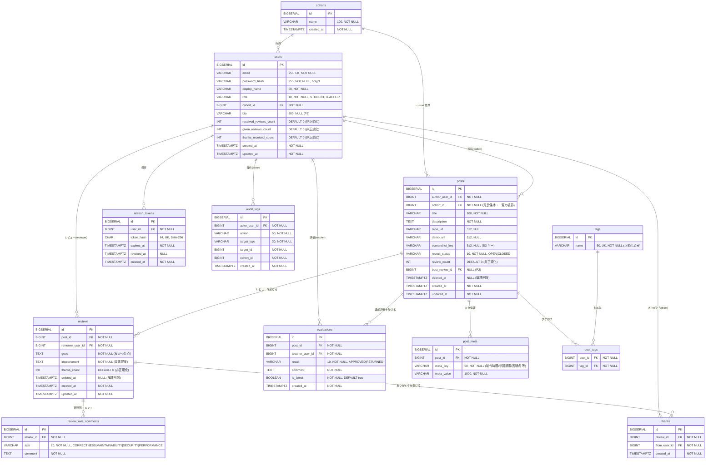

# review-board ER 図・DB 設計書

**プロジェクト名:** review-board (成長支援型レビューコミュニティ)
**作成日:** 2026-05-22
**バージョン:** 1.0
**作成者:** hideharu-AI

> 本ドキュメントは [要件定義書](./要件定義書.md) §3-2（RBAC）・[機能一覧.md](./機能一覧.md) の F-ID を
> データモデルに落としたもの。slack-board / sns-board の ER図.md を雛形に、review-board 特化
> （**重点軸＝認可・cohort 境界・成長記録が主役**）で設計する。

---

## 改訂履歴

| 版 | 日付 | 改訂者 | 内容 |
|---|---|---|---|
| 1.0 | 2026-05-22 | hideharu-AI | 初版。Phase 1 全テーブル（cohorts/users/posts/post_meta/tags/reviews/review_axis_comments/thanks/evaluations/audit_logs）を確定。cohort 境界・非正規化カウンタ・Flyway 方針を記載 |

---

## 関連ドキュメント

- [要件定義書](./要件定義書.md) — §3-2 RBAC・§4 非機能（重点軸・S-3 整合性）
- [機能一覧.md](./機能一覧.md) — F-ID の入出力（本書のテーブルと対応）
- [技術スタック.md](./技術スタック.md) — PostgreSQL / Flyway / S3
- 共通の設計方針（リポジトリ外で管理） — SEC / S-3 / S-4 / P-2 / P-3 の原典

---

## 1. 設計方針

- **cohort を全認可境界の根に置く**：users・posts は `cohort_id` を持ち、参照系は必ず cohort で絞る（IDOR を SQL レベルで遮断、SEC-2/3）
- **role を最初から持つ**：`users.role`（STUDENT / TEACHER）。後付け回避（R-04）
- **論理削除**（`deleted_at`）で成長記録の参照整合性・履歴を保つ（S-4）
- **非正規化カウンタ + 定期再計算**：成長記録の集計（受/送レビュー数・ありがとう数）はカウンタ列に持ち、ズレは定期バッチで補正（S-3）
- **作品メタは `post_meta` に集約**：制作時間・学習期間・苦戦点等を個別カラム化せず key-value で受ける（スキーマ肥大回避・PR#78 方針）
- 命名は `snake_case`、PK は `BIGSERIAL id`、時刻は `TIMESTAMPTZ`、マイグレーションは **Flyway**

---

## 2. ER 図

### Phase 1 (MVP) 範囲



### Phase 2〜3 追加テーブル / 列（概要のみ）

| 区分 | 追加 | Phase |
|---|---|---|
| 列 | `posts.reviewer_preference`（初学者歓迎/辛口OK/優しめ希望）・`posts.best_review_id` | 2 |
| テーブル | `notifications`（ポーリング通知）・`review_replies`（返信スレッド）・`post_attachments`（ER図/API仕様書 等の添付・S3） | 2 |
| テーブル | `badges` / `user_streaks`（連続投稿・継続日数・達成バッジ） | 2 |
| テーブル | `follows`（フォロー関係） | 3 |
| 列 | `posts.github_*`（README/リポジトリ情報のキャッシュ） | 3 |

---

## 3. Phase 1 テーブル定義（補足）

### 3-1. users
- `email` UNIQUE（ログイン ID）。`password_hash` は bcrypt。`role` は `STUDENT|TEACHER`（CHECK 制約）
- `cohort_id` NOT NULL。**全認可の起点**。3 つの非正規化カウンタは成長記録ページ（F-PROF-03）の表示用
- アカウントは管理者が発行（招待制・F-AUTH-02）。サインアップ経路は持たない

### 3-2. posts
- `cohort_id` は author の cohort を**冗長コピー**。一覧（F-POST-03）を `WHERE cohort_id=:authCohort` だけで安全に絞るため
- `screenshot_key` は S3（ローカル MinIO）オブジェクトキー。本体は DB に置かない（P-10）
- `recruit_status` で「レビュー募集中」を表現（F-FILTER-01 の絞り込み起点）

### 3-3. reviews / review_axis_comments / thanks
- `reviews.good` / `improvement` は必須。観点別は `review_axis_comments`（任意・1 軸 1 行、UNIQUE(review_id, axis)）
- `thanks` は UNIQUE(review_id, from_user_id) で**冪等**（二重ありがとう防止）。発生時に `reviews.thanks_count` と `users.thanks_received_count` を加算
- 自己レビュー禁止（`reviews.reviewer_user_id != posts.author_user_id`）はアプリ層で検証

### 3-4. evaluations（講師評価）
- 1 投稿に複数行を積み、最新だけ `is_latest=true`（差し戻し→再評価の履歴を残す・S-4）
- `result=APPROVED` が成長記録の合格バッジ（F-PROF-04）の根拠

### 3-5. audit_logs（★重点軸）
- 認可境界をまたぐ操作（投稿・レビュー・評価・ログイン）を記録。重点基準「誰が・いつ・誰の資源に・何を」を満たす

---

## 4. インデックス設計

| テーブル | インデックス | 目的 |
|---|---|---|
| users | `UNIQUE(email)` / `(cohort_id)` | ログイン / cohort 絞り |
| posts | `(cohort_id, created_at DESC, id DESC)` | 一覧のカーソル pagination + cohort 境界（P-2、IDOR） |
| posts | `(author_user_id)` | 成長記録の投稿履歴 |
| reviews | `(post_id)` / `(reviewer_user_id)` | 投稿のレビュー一覧 / したレビュー実績 |
| review_axis_comments | `UNIQUE(review_id, axis)` | 1 軸 1 コメント |
| thanks | `UNIQUE(review_id, from_user_id)` | 冪等 |
| evaluations | `(post_id, is_latest)` | 最新評価の即時取得 |
| post_tags | `UNIQUE(post_id, tag_id)` / `(tag_id)` | 重複防止 / タグ検索(P2) |
| tags | `UNIQUE(name)` | 正規化・重複防止 |
| audit_logs | `(target_type, target_id)` / `(actor_user_id, created_at)` | 監査追跡 |

---

## 5. 非正規化カウンタの同期戦略

### 5-1. なぜ非正規化するか
成長記録ページ（F-PROF）は「もらった/したレビュー数・ありがとう数・投稿のレビュー数」を高頻度で表示する。
毎回 COUNT すると N+1・遅延の温床（P-3）。カウンタ列で O(1) 取得する。

### 5-2. 同期方法
- 書き込み（レビュー作成/削除・ありがとう付与/取消）と同一トランザクションでカウンタを増減（サービス層）
- 論理削除（`deleted_at`）時もカウンタを減算

### 5-3. 整合性が崩れた場合の修復
- **定期再計算バッチ**（日次）で実測 COUNT とカウンタを突合・補正（S-3）。ズレ検出はログに出す

---

## 6. 命名規約

- テーブル名：複数形 snake_case（`posts`, `review_axis_comments`）
- 外部キー：`<対象単数>_id`（`post_id`, `reviewer_user_id`）
- 真偽値：`is_*`（`is_latest`）。時刻：`*_at`（`created_at`, `deleted_at`）
- enum 相当は VARCHAR + CHECK 制約（`role`, `recruit_status`, `result`, `axis`）

---

## 7. 拡張性方針

- 複数 cohort 出し分け（Phase 3・F-COHORT-01）は `cohort_id` が既にあるため**テーブル変更不要**（R-04 を予防）
- 行単位レビュー（Phase 3・F-LINE-01）は `review_targets`（行範囲/座標）を将来追加。reviews は親として再利用
- フォロー（Phase 3・F-FOLLOW-01）は `follows(follower_id, followee_id)` を追加するだけ

---

## 8. データ量想定（学習用）

- 1 cohort 5〜30 名 × 投稿 数件/人 × レビュー 数件/投稿 → Phase 1 は数千行規模。無料枠 RDS で十分

---

## 9. セキュリティ（★重点軸）

- **cohort 境界**：posts/reviews/profile の参照は必ず `cohort_id=:authCohort` を条件に含める。不一致は **404**（存在を漏らさない、IDOR）
- **所有者検証**：投稿/レビューの編集・削除は `author/reviewer == 認証ユーザー` を検証。不一致は 403/404
- **権限昇格防止**：`evaluations` への書き込みは `role=TEACHER` 必須（受講生は 403）。認可テストで必ず確認
- クライアントから来る `user_id` / `cohort_id` は信用せず、認証コンテキストから導出
- 本文（description / good / improvement / comment）は表示時に DOMPurify でサニタイズ（XSS）

---

## 10. マイグレーション方針

- **Flyway**。`V1__init.sql` に Phase 1 全テーブル + インデックス + CHECK 制約
- 以降は `V2__add_notifications.sql` のように Phase ごとに追加（既存変更は新マイグレーションで、手 ALTER しない）

### 初期マイグレーションファイル想定
```
backend/src/main/resources/db/migration/
  V1__init.sql              # Phase 1 全テーブル
  V2__phase2_xxx.sql        # 通知・返信・バッジ 等（Phase 2 着手時）
```

---

## 11. シードデータ（開発環境のみ）

- cohort 1 件、講師 1 名 + 受講生 3 名、サンプル投稿数件 + レビュー数件
- パスワードは bcrypt ハッシュをシードに直書きしない（環境変数 or 起動時生成）。**平文機密のコミット禁止**（SEC-9）

---

## 12. 用語

| 用語 | 意味 |
|---|---|
| cohort | 期・コース・クラス。全認可境界の単位 |
| 成長記録 | ユーザーごとの投稿・レビュー・合格バッジの集積ページ（本アプリの主役） |
| 合格バッジ | 講師が `APPROVED` した成果物の証跡（F-PROF-04） |
| 観点別コメント | 品質指標（動作・可読性・セキュリティ・性能）に沿ったレビュー（任意） |

---

## TODO / レビュー観点

- [ ] 画面設計書.md の S-01〜S-20 が本テーブルの操作と整合すること
- [ ] テスト計画書.md の認可テストが cohort 境界（§9）を全網羅すること
- [ ] `V1__init.sql` 起こし時に CHECK 制約・FK の ON DELETE 方針（論理削除前提で RESTRICT 基本）を確定
- [ ] 非正規化カウンタの再計算バッチの実装方針（Spring `@Scheduled`）を技術スタック.md に追記
