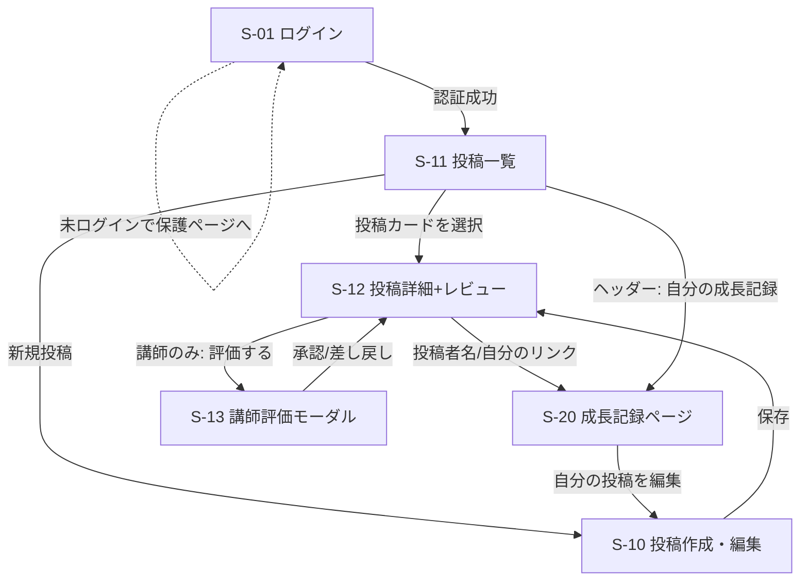

# review-board 画面設計書

**プロジェクト名:** review-board (成長支援型レビューコミュニティ)
**作成日:** 2026-05-22
**バージョン:** 1.0
**作成者:** hideharu-AI

> 本ドキュメントは [機能一覧.md](./機能一覧.md) の F-ID と「関連画面」列を画面に落としたもの。
> slack-board の画面設計書.md を雛形に、review-board 特化（**成長記録ページが主役**・クローズド・
> ロール差）で設計する。画面 ID は機能一覧の関連画面（S-01〜S-20）と一致させる。

---

## 改訂履歴

| 版 | 日付 | 改訂者 | 内容 |
|---|---|---|---|
| 1.0 | 2026-05-22 | hideharu-AI | 初版。Phase 1 画面（S-01/S-10〜S-13/S-20）を確定。遷移図・各画面詳細・A11y・レスポンシブ・エラー共通 |

---

## 関連ドキュメント

- [機能一覧.md](./機能一覧.md) — F-ID・API・関連画面
- [ER図.md](./ER図.md) — 表示するデータの源
- [要件定義書](./要件定義書.md) — §3-2 RBAC・§1-5 差別化（主役＝成長記録）

---

## 1. 設計方針

- **主役は成長記録ページ（S-20）**。一覧（S-11）→ 詳細（S-12）→ 成長記録（S-20）へ自然に誘導する
- **全画面ログイン必須**（未ログインは S-01 へ）。クローズド前提でゲスト画面を持たない
- **ロール差は UX 上の出し分け**（講師のみ S-13 の評価ボタンを表示）。ただし **本質的な防御はバックエンド認可**であり、UI 非表示は防御ではないと明記（要件定義書 §3-2）
- レビューは**品質指標の観点枠**で構造化入力（空疎な自由記述を避ける・差別化ポイント）
- React + Tailwind。SPA、ヘッダー共通（ロゴ・自分の成長記録リンク・ログアウト）

---

## 2. 画面一覧

| ID | 画面名 | 主な機能 | アクター | Phase |
|---|---|---|---|---|
| **S-01** | ログイン画面 | F-AUTH-01 | 未ログイン | 1 |
| **S-10** | 成果物 投稿・編集画面 | F-POST-01/02 | 受講生・講師 | 1 |
| **S-11** | 投稿一覧画面（同 cohort） | F-POST-03 | ログインユーザー | 1 |
| **S-12** | 投稿詳細 ＋ レビュー画面 | F-REV-01/02/03 | ログインユーザー | 1 |
| **S-13** | 講師評価モーダル | F-EVAL-01 | 講師のみ | 1 |
| **S-20** | 成長記録ページ（主役） | F-PROF-01〜04 | ログインユーザー | 1 |
| S-02 | 検索結果画面 | F-SEARCH-01/F-FILTER-01 | ログインユーザー | 2 |
| S-03 | 通知センター | F-NOTIF-01 | ログインユーザー | 2 |
| S-04 | プロフィール編集 | （成長記録の編集） | 本人 | 2 |
| S-30 | 行単位レビュー画面 | F-LINE-01 | ログインユーザー | 3 |

---

## 3. 画面遷移図（Phase 1）

---

## 4. 各画面の詳細

### S-01 ログイン画面（F-AUTH-01）

- **要素**：メール入力・パスワード入力・ログインボタン・エラーメッセージ領域
- **操作**：送信 → `POST /api/auth/login`。成功で Cookie 発行 → S-11 へ。失敗は汎用エラー（ユーザー存在を漏らさない）
- **備考**：サインアップ導線なし（招待制・F-AUTH-02）。パスワード再設定は Phase 2 以降

### S-10 成果物 投稿・編集画面（F-POST-01/02）

- **要素**：タイトル／説明（複数行）／リポジトリ URL／デモ URL／スクショアップロード（プレビュー付）／技術タグ入力（オートコンプリートは P2）／見てほしい点／レビュー募集状態（OPEN/CLOSED）／作品メタ（任意の key-value・`post_meta`）
- **操作**：保存 → `POST /api/posts`（新規）/ `PUT /api/posts/:id`（編集、自分のみ）。削除は論理削除
- **バリデーション**：タイトル 1〜100、説明 1〜5000、URL 形式、スクショ 5MB・JPEG/PNG/WebP
- **ロール差**：なし（受講生・講師とも投稿可）

### S-11 投稿一覧画面（同 cohort・メイン入口）（F-POST-03）

- **要素**：投稿カード（サムネ＝スクショ／タイトル／投稿者／技術タグ／募集中バッジ／レビュー数）・新規投稿ボタン・「もっと見る」（カーソル pagination）
- **操作**：`GET /api/posts?cursor=&limit=20`（**自分の cohort のみ**）。カード選択で S-12
- **備考**：絞り込み（未レビュー/募集中）・検索は Phase 2（S-02）

### S-12 投稿詳細 ＋ レビュー画面（F-REV-01/02/03）

- **要素**：
  - 成果物情報（スクショ・説明・URL・タグ・見てほしい点・作品メタ・**合格バッジ**があれば表示）
  - レビュー投稿フォーム：✅良かった点（必須）／💡もっと良くなる点（必須）／観点別（任意・①動作・正しさ ②可読性・保守性 ③セキュリティ ④性能・UX）
  - レビュー一覧：各レビューに**講師バッジ**（F-REV-02）・「ありがとう」ボタン（投稿者のみ・F-REV-03）
  - 講師の場合のみ「評価する」ボタン → S-13
- **操作**：`POST /api/posts/:id/reviews`／`POST /api/reviews/:id/thanks`（投稿者のみ）
- **ガード**：自分の投稿には投稿フォームを出さない（自己レビュー禁止）。他 cohort の投稿は遷移自体不可（404）

### S-13 講師評価モーダル（F-EVAL-01・講師のみ）

- **要素**：結果ラジオ（承認＝合格／差し戻し）・評価コメント（必須）・送信
- **操作**：`POST /api/posts/:id/evaluation`。成功で S-12 に最新評価を反映（合格なら合格バッジ点灯）
- **ロール差**：**講師のみ表示**。受講生がボタンを偽装しても **API が 403**（UI 非表示は防御でない）

### S-20 成長記録ページ（主役）（F-PROF-01〜04）

- **要素**：
  - プロフィール（表示名・自己紹介・使用技術）
  - 投稿履歴（F-PROF-01）／**合格バッジ**一覧（F-PROF-04・最高の証跡）
  - もらったレビュー（講師レビューは強調・F-PROF-02）
  - したレビュー実績（件数・もらった「ありがとう」数・F-PROF-03）
- **操作**：`GET /api/users/:id/profile`（**同 cohort のみ**閲覧可、他は 404）
- **備考**：継続の可視化（連続投稿・継続日数・バッジ）は Phase 2（§1-6「継続は力なり」）

---

## 5. Phase 2〜3 画面の概要（詳細は Phase 着手時）

- **S-02 検索結果**（P2）：キーワード/タグ検索・絞り込み（未レビュー/募集中）・並び替え
- **S-03 通知センター**（P2）：レビュー付いた/ありがとう（ポーリング）
- **S-04 プロフィール編集**（P2）：自己紹介・使用技術・心理的安全設定（初学者歓迎/辛口OK 等）
- **S-30 行単位レビュー**（P3）：行番号指定・コード引用・スクショへのピンコメント

---

## 6. アクセシビリティ（WCAG 2.1 Level A 相当）

- フォーム要素に `label`／フォーカスリング保持／キーボード操作可能
- 合格バッジ・講師バッジは色だけに依存せずテキスト/アイコン併記
- 画像（スクショ）に代替テキスト、エラーは `aria-live` で通知

---

## 7. レスポンシブ ブレークポイント

| 区分 | 幅 | レイアウト |
|---|---|---|
| モバイル | 〜640px | 1 カラム（カード縦積み・モーダル全画面） |
| タブレット | 641〜1024px | 一覧 2 カラム |
| PC | 1025px〜 | 一覧 3 カラム・詳細はサイド情報併記 |

---

## 8. エラーハンドリング（画面共通）

| 状況 | HTTP | 画面挙動 |
|---|---|---|
| 未認証 | 401 | S-01 ログインへリダイレクト |
| 権限不足（受講生が評価等） | 403 | 「権限がありません」トースト、操作不可 |
| 存在しない / 他 cohort | 404 | 「ページが見つかりません」（存在を漏らさない＝IDOR 配慮） |
| バリデーション | 400 | フォーム各項目にインラインエラー |
| レート超過 | 429 | 「しばらく待って再試行」トースト |

---

## TODO / レビュー観点

- [ ] S-01〜S-20 が機能一覧の「関連画面」列と一致していること（整合確認）
- [ ] S-13 の講師限定が、UI 非表示だけでなくバックエンド 403 でも担保されること（テスト計画書 認可マトリクス）
- [ ] ワイヤーフレーム（簡易）を Figma 等で起こすかは Phase 1 実装着手時に判断
- [ ] 合格バッジ・講師バッジの視覚デザイン（色 + アイコン + ラベル）を確定
